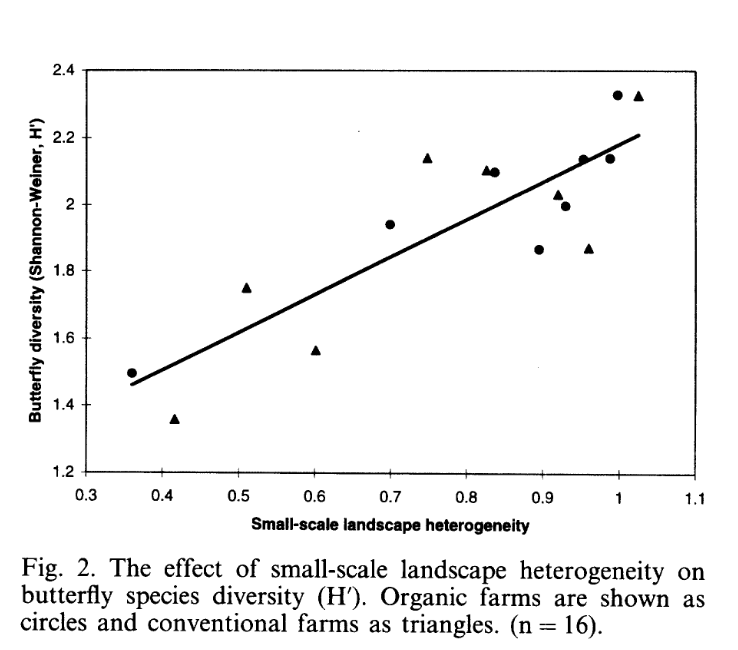

# Set up

```{r}
library(tidyverse)
library(here)
library(janitor)
library(readxl)
library(ggeffects)

# store personal data
my_data <- read_csv(here("data" , "personaldataproject.csv"))

# store kelp data
temp_kelp <- read_csv(here("data", "temp-kelp.csv"))
```

# Problems

## Problem 1. Giant Kelp Fronds

### a. An Appropriate Test

Pearson and Spearman correlations could be used to determine strength of the relationship between temperature and giant kelp frond elongation rate assuming observations are independent. Pearson's correlation also assumes a linear relationship exists and it is a parametric test meaning it assumes variables are normally distributed. Spearman's correlation assumes a monotonic relationship and it is a nonparametric test meaning normality is not an assumption.

### b. Visualizing Data

Showing the relationship between temperature and giant kelp frond elongation rate.

```{r}
# plot raw data points to observe potential linear relationship

# base layer ggplot
ggplot(data = temp_kelp,
       # assign data to axes
       aes(x = temp_c,
           y = kelp_elong))+
# first layer: add scatter points
  geom_point(size = 2,
             stroke = 0.5,
             fill = "dodgerblue3",
             shape = 21)+
  
# relabel axis with units
  labs(x = "Temperature (°C)",
       y = "Giant Kelp Frond Growth Rate (cm/day)")+
# change theme
  theme_light()+
  theme(panel.grid = element_blank())
# data appears fairly linear, proceed with diagnostic tests
```

### c. Check Assumptions and Run Test

```{r}
#| echo: true
#| fig-width: 8
#| fig-height: 8
# create object storing linear model data to perform diagnostic tests
temp_kelp_model <- lm(kelp_elong~temp_c,
   data = temp_kelp)

# diagnostic plots
par(mfrow = c(2,2))
plot(temp_kelp_model)
```

#### Assumption of Pearson's correlation

To check the assumptions of a Pearson correlation test I evaluated the linearity, continuous data, normality and independence of observations.

I checked linearity by looking at the scatter plot generated in 1b; if I drew a line from the lowest temp/highest growth rate point to one of the high-temp/low-growth points the data would fall around that line. Temperature and growth rate are both continuous variables (they can be measured to decimal places or fractions). Looking at diagnostic QQ plot, the data appears normally distributed since the data follows the line closely only deviating strongly in the tails which is acceptable. Finally, the assumption of independent variables is a potential limitation since the study design does not explicitly say if the kelp fronds were isolated in separate, independently regulated tanks; however, we are going to proceed with the analysis.

#### Run a correlation test

```{r}
#| echo: true
# Run Pearson Correlation test
cor.test(temp_kelp$kelp_elong, # predicted/y value
         temp_kelp$temp_c,     # predictor/x value
         method = "pearson")   # use pearson method
```

### d. Results Communication

To evaluate the strength of the relationship between temperature and giant kelp frond elongation rate, I used a Pearson's Correlation test. The data appears to be normally distributed based on the QQ plot diagnostic test meaning this parametric test is fitting.

We found a moderate-to-strong negative relationship between giant kelp frond elongation rate (in cm/day) and Temperature (in degrees Celsius) (Pearson's r = -0.69, t(30) = -5.19, p \< 0.01, α = 0.05).

### e. Test Implications

Our tests suggest a moderately strong statistically significant negative relationship (r = -0.69, p\< 0.01) between temperature and kelp growth, meaning that giant kelp frond elongations rates decrease as water temperatures rise. To maximize conservation efforts I would suggest prioritizing protecting the cooler areas where kelp has higher chances of survival.

### f. Run Other Correlation Test

```{r}
#| echo: true
# Run Spearman Correlation test
cor.test(temp_kelp$kelp_elong, # predicted/y value
         temp_kelp$temp_c,     # predictor/x value
         method = "spearman")  # change method to spearman
```

Both of these test lead me to reject the null hypothesis because they both yielded a p-value \< 0.01. Both methods lead to me to say there is a moderate-to-strong negative relationship between water temperature and giant kelp frond elongation rate because the Spearman rank coefficient ($\rho$ = -0.689) is close to the Pearson correlation coefficient (Pearson's r = -0.688). This directly relates to the variables by confirming that as the continuous variable of water temperature increases, the giant kelp frond elongation rate decreases, a trend that remains robust whether measured linearly (with Pearson) or monotonically through ranked data (with Spearman).

## Problem 2. Personal Data

### a. Updating Visualizations

```{r}
# organize day of week column so variable shows up in chronological order
# instead of alphabetical
my_data$day_of_the_week <- factor(my_data$day_of_the_week,
levels = c("Monday", "Tuesday", "Wednesday",
"Thursday", "Friday", "Saturday",
"Sunday"))
# create plot, assign x and y values.
# X is a categorical predictor variable, Y is response variable.
ggplot(my_data, aes(x = day_of_the_week, y = perceived_stress_level))+

# create jitter plot with custom color
geom_jitter(height = 0,
            width = 0.2,
            shape = 21,
            size = 3,,
            fill = "lightpink",
            alpha = 0.8,
            color = "hotpink") +
# change graph title and axis titles

labs(title = "Perceived Stress by Day of the Week",
     subtitle = "5/22/2026",
x = "Day of the Week",
y = "Perceived Stress Level (1-5)")+
  
# change theme
  theme_bw()+
# remove grid
  theme(panel.grid = element_blank())
```

```{r}
# create plot, assign x and y values
# X is my discrete predictor variable, Y is response variable.
ggplot(my_data, aes(x = daily_step_count, y = perceived_stress_level))+
#create plot with custom color
geom_point(shape = 19,
            size = 3,
           alpha = 0.7,
           color = "#003660") +
# change graph title and axis titles
labs(title = "Perceived Stress vs Daily Step Count",
     subtitle = "5/22/2026",
x = "Daily Step Count (steps)",
y = "Perceived Stress Level (1-5)")+

# choosing non-default theme
  theme_bw()+
  
# remove grid
  theme(panel.grid = element_blank())
```

### b. Captions

**Figure 1. Day of the week appears to have little impact on perceived stress level.** Each pink circle represents a single day's self-reported stress level on a scale of 1-5. The points are jittered and semi-transparent to show overlapping points. Days of the week are represented on the x axis, ordered from Monday to Sunday. There appears to be examples of low stress everyday of the week and high stress almost everyday. Tuesdays, Fridays, and Sundays tend to be lower stress. Wednesdays, Thursdays, and Saturdays appear to be the highest stress day of the week. Day of the week is the categorical predictor variable and stress is the categorical response variable.

**Figure 2. There appears to be a potential negative linear relationship between perceived stress level and daily step count.** The navy blue dots represent a single day's self-reported stress level on a scale of 1-5 and are ordered on the x axis by daily step count recorded by a fitbit watch. Daily step count is the discrete predictor variable and stress is the categorical response variable.

## Problem 3. Affective Visualization

### a.

I imagine an affective visualization for my step count vs stress could be expressed through a watercolor painting incorporating nature elements like Jill Pelto's work. I could see a mountain representing steps it takes to get to a less stressed mindset since I observed a potential linear relationship suggesting more steps leads to less stress. I could use colors to convey emotion (ex. sunny bright yellow representing less stressed and gray-blue skies to represent more stressed).

### b. Affective Sketch


### c. Affective draft


### d. Artist Statement

This watercolor painting represents the relationship between my daily step counts and my daily perceived stress level. I was inspired by Jill Pelto's paintings. I started my process by drafting with pencil and paper, created a digital rendition on my iPad to get a more solidified idea of color placement and finally, I mapped my design onto watercolor paper and painted my final draft.

### e. Affective Visualization Presentation

[View Presentation](https://docs.google.com/presentation/d/1glp9oR2FnJ8XfaEktwrQycuCjJGYJR0yKOwzFoXmA-U/edit?usp=sharing)

## Problem 4. Statistical Critique

### a.

The main research question is "What are the impacts of farming system (organic vs conventional) and landscape heterogeneity (large scale vs small scale) on butterfly diversity and species composition?" 
A Pearson correlation test is used in this paper. This test led the researchers to suggest that landscape heterogeneity is an important factor in butterfly diversity. A “significant” result would lead them to suggest there is a positive correlation between butterfly diversity and small-scale landscape heterogeneity.



### b.

The authors visually represented their statistics in figures well. The one shown above clearly shows the positive linear relationship suggested by the pearson correlation test. The axes make sense; the predictor variable (landscape heterogeneity) is on the x axis and the response variable (butterfly diversity) on the y-axis. Summary statistics are not shown, but the model prediction is represented by a line and underlying data is shown.

### c.

### d.
